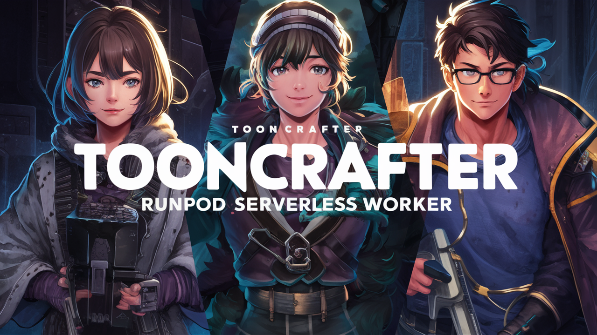

# RunPod Serverless ToonCrafter Worker



This project allows users to install ToonCrafter, an AI model that generates videos by interpolating frames betwen 2 images on RunPod serverless platform.

## Docker image

Docker image available at: [Docker Hub](https://hub.docker.com/r/drvpn/runpod_serverless_tooncrafter_worker)
## Environment Variables

To run this application on RunPod serverless, you need to set the following environment variables:

- `BUCKET_ENDPOINT_URL`: The endpoint URL of your S3-compatible storage.
- `BUCKET_ACCESS_KEY_ID`: The access key ID for your S3-compatible storage.
- `BUCKET_SECRET_ACCESS_KEY`: The secret access key for your S3-compatible storage.

These variables are required to store and host the enhanced MP4 video files.

## Running on RunPod Serverless

### 1. `Clone the Repository`

```sh
git clone https://github.com/drvpn/runpod_serverless_tooncrafter_worker.git
cd runpod_serverless_tooncrafter_worker
```

2. `Build and Push Docker Image`
   - Follow RunPod's documentation to build and push your Docker image to a container registry.

3. `Deploy on RunPod`
   - Go to RunPod's dashboard and create a new serverless function.
   - Use the Docker image you pushed to your container registry.
   - Set the environment variables: `BUCKET_ENDPOINT_URL`, `BUCKET_ACCESS_KEY_ID`, `BUCKET_SECRET_ACCESS_KEY`.

4. `Invoke the Endpoint`

You can invoke the endpoint with a JSON payload specifying the input video URL. Here is an example:

```sh
{
  "input": {
    "input_image1_url": "https://www.example.com/ToonCrafter/image_1.png",
    "input_image2_url": "https://www.example.com/image_2.png",
    "input_text": "the girl is suprised"
  }
}
```

Use RunPod's interface or an HTTPS client (i.e. Postman) to send this payload to the deployed function.

# Input
- `input_image1_url`: URL to image for the first frame of your video (png)(required)
- `input_image2_url`: URL to image for the last frame of your video (png)(required)
- `input_text`: The text prompt to guide the video creation (required)
- `steps`: The number of steps to remove noise from the image and refine it. The higher the number, the more detailed and refined the image will be, but it will take more time. Valid range is `1 - 60`
- `cfg_scale`: Determines how much the prompts are honored, ranging from 1 to 15, where 1 is very little attention to the prompt and 15 is action based on the prompt. Valid range is `1 - 15`
- `eta`:  Adjusts the motion between the two images. A value closer to 1 generates motion based on the left image, 0.5 will reflect 50% of the motion from the left image and 50% of the motion from the right image. Valid range is `0 - 1`
- `fps`: Determines how many frames are created per second. The higher the value, the more natural the scene transition will be. Similarly, the more time it will take to generate. Valid range is `5 - 30`
- `seed`: When expressing the movement of a specific part, the previous movement is not retained, but is generated randomly each time. Valid range is `0 - 50000`

# Default values

- `input_image1_url`: required `no default`
- `input_image2_url`: required `no default`
- `input_text`: required `no default`
- `steps`: `50`
- `cfg_scale`: `7.5`
- `eta`: `1`
- `fps`: `10`
- `seed`: `123`

To override default values, you can set the following (optional) environment variables:

- `DEFAULT_INPUT_IMAGE1_URL`: sets new default for input_image1 URL
- `DEFAULT_INPUT_IMAGE2_URL`: sets new default for input_image2 URL
- `DEFAULT_INPUT_TEXT`: sets new default for input_text
- `DEFAULT_STEPS`: set new default for steps, pick a value between `1` and `60`.
- `DEFAULT_CFG_SCALE`: set new default cfg_scale pick a value between `1` and `15`
- `DEFAULT_ETA`: set new default eta, pick a value between `0` and `1`
- `DEFAULT_FPS`: set new default fps, pick a value between `5` and `30`
- `DEFAULT_SEED`: set new default random seed, pick a value betwen `0` and `50000`

## Example return value
```sh
{
  "delayTime": 491,
  "executionTime": 135484,
  "id": "your-unique-id-will-be-here",
  "output": {
    "output_video_url": "https://mybucket.nyc3.digitaloceanspaces.com/ToonCrafter/2024_06_16_16.20.48.mp4"
  },
  "status": "COMPLETED"
}
```
# Handler Explanation

The `handler.py` script orchestrates the following tasks:

- Maps a network volume to store checkpoints (if available).
- Downloads and caches model checkpoints if not already present.
- Interpolates between image1 and image2 to produce an animation video.
- Uploads the generated video file to S3-compatible storage and returns the public URL.

## Contributing

Contributions are welcome! Please open an issue or submit a pull request.

## License

This project is licensed under the MIT License.
